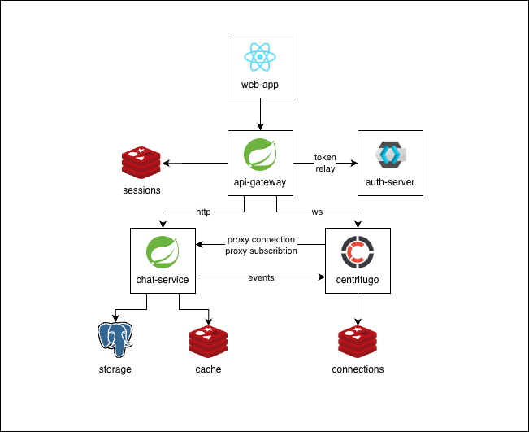

# Centrifugo Chat Demo

Demo project showing the capabilities of the Centrifugo. Centrifugo is a scalable messaging server 
that handles persistent connections over various real-time transports, i.e. WebSocket, SSE, gRPC, etc. 
Visit https://centrifugal.dev/ to learn more.



## Setup

### Prerequisites

- Java 21
- Gradle
- Docker Compose

### Building and Running

```shell
# Build the project
./gradlew build
```

```shell
# Running containers
docker compose up --build -d
```

Once the containers are running, open your browser at http://localhost:5173

Several test users are preconfigured:

| Username  | Password |
|:----------|:---------|
| jamesbond | password |
| johnwayne | password |
| annasmith | password |
| chelsea   | password |

```shell
# Stop containers
docker compose down -v
```

## Monitoring

```shell
# Running Prometheus and Grafana containers
docker compose -f compose.monitoring.yaml up -d
```

Grafana dashboard is available at http://localhost:3000:
```
username: admin  
password: password
```

```shell
# Stop Prometheus and Grafana containers
docker compose -f compose.monitoring.yaml down -v
```
